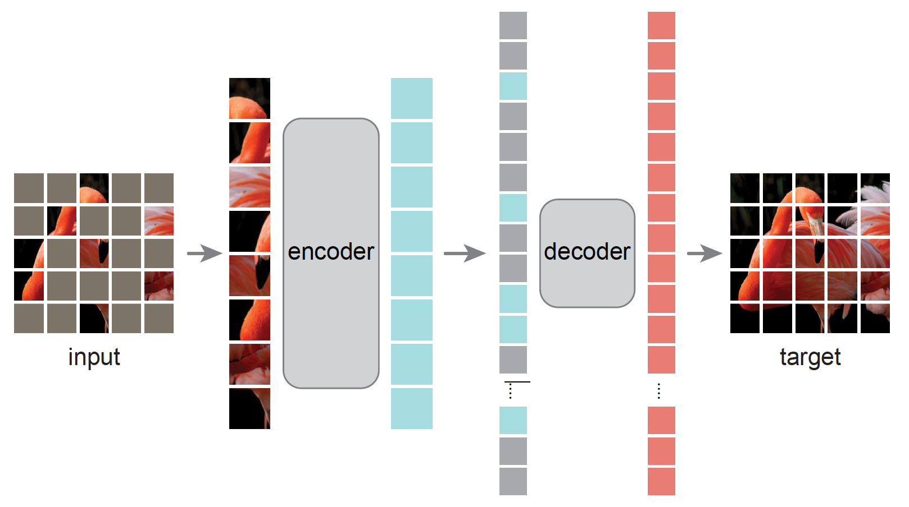

# Awesome Masked Autoencoders
 

  
Fig. 1. Masked Autoencoders from Kaiming He et al.

Masked Autoencoder (MAE, *Kaiming He et al.*) has renewed a surge of interest due to its capacity to learn useful representations from rich unlabeled data. Until recently, MAE and its follow-up works have advanced the state-of-the-art and provided valuable insights in research (particularly vision research). Here I list several follow-up works after or concurrent with MAE to inspire future research.

> *:octocat: code links.

# Vision
+ [🔥Masked Autoencoders Are Scalable Vision Learners](https://arxiv.org/abs/2111.06377) [:octocat:](https://github.com/FlyEgle/MAE-pytorch) [:octocat:](https://github.com/pengzhiliang/MAE-pytorch) Kaiming He, Xinlei Chen, Saining Xie, Yanghao Li, Piotr Dollár, Ross Girshick
+ [🔥SimMIM: A Simple Framework for Masked Image Modeling](https://arxiv.org/abs/2111.09886) [:octocat:](https://github.com/microsoft/SimMIM) Zhenda Xie, Zheng Zhang, Yue Cao, Yutong Lin, Jianmin Bao, Zhuliang Yao, Qi Dai, Han Hu
+ [🔥BEIT: BERT Pre-Training of Image Transformers](https://arxiv.org/abs/2106.08254) [:octocat:](https://github.com/microsoft/unilm/tree/master/beit) Hangbo Bao, Li Dong, Furu Wei
+ [Student Collaboration Improves Self-Supervised Learning: Dual-Loss Adaptive Masked Autoencoder for Brain Cell Image Analysis](https://arxiv.org/abs/2205.05194) [:octocat:](https://github.com/hula-ai/DAMA) Son T. Ly, Bai Lin, Hung Q. Vo, Dragan Maric, Badri Roysam, Hien V. Nguyen
+ [A Mask-Based Adversarial Defense Scheme](https://arxiv.org/abs/2204.11837) Weizhen Xu, Chenyi Zhang, Fangzhen Zhao, Liangda Fang
+ [Adversarial Masking for Self-Supervised Learning](https://arxiv.org/abs/2201.13100) [:octocat:](https://github.com/YugeTen/adios) Yuge Shi, N. Siddharth, Philip H.S. Torr, Adam R. Kosiorek
+ [Beyond Masking: Demystifying Token-Based Pre-Training for Vision Transformers](https://arxiv.org/abs/2203.14313) [:octocat:](https://github.com/sunsmarterjie/beyond_masking) Yunjie Tian, Lingxi Xie, Jiemin Fang, Mengnan Shi, Junran Peng, Xiaopeng Zhang, Jianbin Jiao, Qi Tian, Qixiang Ye
+ [Context Autoencoder for Self-Supervised Representation Learning](https://arxiv.org/abs/2202.03026) [:octocat:](https://github.com/lxtGH/CAE) Xiaokang Chen, Mingyu Ding, Xiaodi Wang, Ying Xin, Shentong Mo, Yunhao Wang, Shumin Han, Ping Luo, Gang Zeng, Jingdong Wang
+ [Contextual Representation Learning beyond Masked Language Modeling](https://arxiv.org/abs/2204.04163) [:octocat:](https://github.com/FUZHIYI/TACO) Zhiyi Fu, Wangchunshu Zhou, Jingjing Xu, Hao Zhou, Lei Li
+ [ContrastMask: Contrastive Learning to Segment Every Thing](https://arxiv.org/abs/2203.09775) [:octocat:](https://github.com/huiserwang/ContrastMask) Xuehui Wang, Kai Zhao, Ruixin Zhang, Shouhong Ding, Yan Wang, Wei Shen
+ [ConvMAE: Masked Convolution Meets Masked Autoencoders](https://arxiv.org/abs/2205.03892) [:octocat:](https://github.com/Alpha-VL/ConvMAE) Peng Gao, Teli Ma, Hongsheng Li, Ziyi Lin, Jifeng Dai, Yu Qiao
+ [Exploring Plain Vision Transformer Backbones for Object Detection](https://arxiv.org/abs/2203.16527) Yanghao Li, Hanzi Mao, Ross Girshick, Kaiming He
+ [Global Contrast Masked Autoencoders Are Powerful Pathological Representation Learners](https://arxiv.org/abs/2205.09048) [:octocat:](https://github.com/StarUniversus/gcmae) Hao Quan, Xingyu Li, Weixing Chen, Qun Bai, Mingchen Zou, Ruijie Yang, Tingting Zheng, Ruiqun Qi, Xinghua Gao, Xiaoyu Cui
+ [iBOT: Image Bert Pre-Training With Online Tokenizer](https://arxiv.org/abs/2111.07832) [:octocat:](https://github.com/bytedance/ibot) Jinghao Zhou, Chen Wei, Huiyu Wang, Wei Shen, Cihang Xie, Alan Yuille, Tao Kong
+ [MADE: Masked Autoencoder for Distribution Estimation](https://arxiv.org/abs/1502.03509) [:octocat:](https://github.com/mgermain/MADE) Mathieu Germain, Karol Gregor, Iain Murray, Hugo Larochelle
+ [Mask Transfiner for High-Quality Instance Segmentation](https://arxiv.org/abs/2111.13673) [:octocat:](http://vis.xyz/pub/transfiner) Lei Ke, Martin Danelljan, Xia Li, Yu-Wing Tai, Chi-Keung Tang, Fisher Yu
+ [Masked Autoencoders As Spatiotemporal Learners](https://arxiv.org/abs/2205.09113) Christoph Feichtenhofer, Haoqi Fan, Yanghao Li, Kaiming He
+ [Masked Discrimination for Self-Supervised Learning on Point Clouds](https://arxiv.org/abs/2203.11183) [:octocat:](https://github.com/haotian-liu/MaskPoint) Haotian Liu, Mu Cai, Yong Jae Lee
+ [Masked Feature Prediction for Self-Supervised Visual Pre-Training](https://arxiv.org/abs/2112.09133) Chen Wei, Haoqi Fan, Saining Xie, Chao-Yuan Wu, Alan Yuille, Christoph Feichtenhofer
+ [Masked Image Modeling Advances 3D Medical Image Analysis](https://arxiv.org/abs/2204.11716)  Zekai Chen, Devansh Agarwal, Kshitij Aggarwal, Wiem Safta, Mariann Micsinai Balan, Venkat Sethuraman, Kevin Brown
+ [Masked Siamese Networks for Label-Efficient Learning](https://arxiv.org/abs/2204.07141) [:octocat:](https://github.com/facebookresearch/msn) Masked Siamese Networks for Label-Efficient Learning
+ [MaskGIT: Masked Generative Image Transformer](https://arxiv.org/abs/2202.04200) [:octocat:](https://github.com/google-research/maskgit) Huiwen Chang, Han Zhang, Lu Jiang, Ce Liu, William T. Freeman
+ [MLIM: Vision-and-Language Model Pre-training with Masked Language and Image Modeling](https://arxiv.org/abs/2109.12178) Tarik Arici, Mehmet Saygin Seyfioglu, Tal Neiman, Yi Xu, Son Train, Trishul Chilimbi, Belinda Zeng, Ismail Tutar
+ [SimMC: Simple Masked Contrastive Learning of Skeleton Representations for Unsupervised Person Re-Identification](https://arxiv.org/abs/2204.09826) [:octocat:](https://github.com/Kali-Hac/SimMC) Haocong Rao, Chunyan Miao
+ [VideoMAE: Masked Autoencoders are Data-Efficient Learners for Self-Supervised Video Pre-Training](https://arxiv.org/abs/2203.12602) [:octocat:](https://github.com/MCG-NJU/VideoMAE) Zhan Tong, Yibing Song, Jue Wang, Limin Wang
+ [What to Hide from Your Students: Attention-Guided Masked Image Modeling](https://arxiv.org/abs/2203.12719) Ioannis Kakogeorgiou, Spyros Gidaris, Bill Psomas, Yannis Avrithis, Andrei Bursuc, Konstantinos Karantzalos, Nikos Komodakis
+ [Uniform Masking: Enabling MAE Pre-training for Pyramid-based Vision Transformers with Locality](https://arxiv.org/abs/2205.10063) [:octocat:](https://github.com/implus/UM-MAE) Xiang Li, Wenhai Wang, Lingfeng Yang, Jian Yang
+ [Self-supervised 3D anatomy segmentation using self-distilled masked image transformer (SMIT)](https://arxiv.org/abs/2205.10342) Jue Jiang, Neelam Tyagi, Kathryn Tringale, Christopher Crane, Harini Veeraraghavan
+ [FaceMAE: Privacy-Preserving Face Recognition via Masked Autoencoders](https://arxiv.org/abs/2205.11090) [:octocat:](https://github.com/kaiwang960112/FaceMAE) Kai Wang, Bo Zhao, Xiangyu Peng, Zheng Zhu, Jiankang Deng, Xinchao Wang, Hakan Bilen, Yang You
+ [Deeper vs Wider: A Revisit of Transformer Configuration](https://arxiv.org/abs/2205.10505) Fuzhao Xue, Jianghai Chen, Aixin Sun, Xiaozhe Ren, Zangwei Zheng, Xiaoxin He, Xin Jiang, Yang You
+ [Masked Conditional Video Diffusion for Prediction, Generation, and Interpolation](https://arxiv.org/abs/2205.09853) [:octocat:](https://github.com/voletiv/mcvd-pytorch) Vikram Voleti, Alexia Jolicoeur-Martineau, Christopher Pal
+ [Green Hierarchical Vision Transformer for Masked Image Modeling](https://arxiv.org/abs/2205.13515) [:octocat:](https://github.com/LayneH/GreenMIM) Lang Huang, Shan You, Mingkai Zheng, Fei Wang, Chen Qian, Toshihiko Yamasaki
+ [Revealing the Dark Secrets of Masked Image Modeling](https://arxiv.org/abs/2205.13543) Zhenda Xie, Zigang Geng, Jingcheng Hu, Zheng Zhang, Han Hu, Yue Cao
+ [MixMIM: Mixed and Masked Image Modeling for Efficient Visual Representation Learning](https://arxiv.org/abs/2205.13137) [:octocat:](https://github.com/Sense-X/MixMIM) Jihao Liu, Xin Huang, Yu Liu, Hongsheng Li
+ [Contrastive Learning Rivals Masked Image Modeling in Fine-tuning via Feature Distillation](https://arxiv.org/abs/2205.14141) [:octocat:](https://github.com/SwinTransformer/Feature-Distillation) Yixuan Wei, Han Hu, Zhenda Xie, Zheng Zhang, Yue Cao, Jianmin Bao, Dong Chen, Baining Guo
+ [Architecture-Agnostic Masked Image Modeling -- From ViT back to CNN](https://arxiv.org/abs/2205.13943) [:octocat:](https://github.com/Westlake-AI/openmixup) Siyuan Li, Di Wu, Fang Wu, Zelin Zang, Kai Wang, Lei Shang, Baigui Sun, Hao Li, Stan.Z.Li
+ [SupMAE: Supervised Masked Autoencoders Are Efficient Vision Learners](https://arxiv.org/abs/2205.14540) [:octocat:](https://github.com/cmu-enyac/supmae)  Feng Liang, Yangguang Li, Diana Marculescu
+ [Object-wise Masked Autoencoders for Fast Pre-training](https://arxiv.org/abs/2205.14338) Jiantao Wu, Shentong Mo
+ [Multimodal Masked Autoencoders Learn Transferable Representations](https://arxiv.org/abs/2205.14204) Xinyang Geng, Hao Liu, Lisa Lee, Dale Schuurmans, Sergey Levine, Pieter Abbeel
+ [MaskOCR: Text Recognition with Masked Encoder-Decoder Pretraining](https://arxiv.org/abs/2206.00311) Pengyuan Lyu, Chengquan Zhang, Shanshan Liu, Meina Qiao, Yangliu Xu, Liang Wu, Kun Yao, Junyu Han, Errui Ding, Jingdong Wang
+ [Mask DINO: Towards A Unified Transformer-based Framework for Object Detection and Segmentation](https://arxiv.org/abs/2206.02777) [:octocat:](https://github.com/IDEACVR/MaskDINO) Feng Li, Hao Zhang, Huaizhe xu, Shilong Liu, Lei Zhang, Lionel M. Ni, Heung-Yeung Shum
+ [Efficient Self-supervised Vision Pretraining with Local Masked Reconstruction](https://arxiv.org/abs/2206.00790) Jun Chen, Ming Hu, Boyang Li, Mohamed Elhoseiny
+ [Masked Unsupervised Self-training for Zero-shot Image Classification](https://arxiv.org/abs/2206.02967) [:octocat:](https://github.com/salesforce/MUST) Junnan Li, Silvio Savarese, Steven C.H. Hoi
+ [On Data Scaling in Masked Image Modeling](https://arxiv.org/abs/2206.04664) Zhenda Xie, Zheng Zhang, Yue Cao, Yutong Lin, Yixuan Wei, Qi Dai, Han Hu
+ [Draft-and-Revise: Effective Image Generation with Contextual RQ-Transformer](https://arxiv.org/abs/2206.04452) [:octocat:](https://github.com/kakaobrain/rq-vae-transformer) Doyup Lee, Chiheon Kim, Saehoon Kim, Minsu Cho, Wook-Shin Han
+ [Layered Depth Refinement with Mask Guidance](https://arxiv.org/abs/2206.03048) [:octocat:](https://sooyekim.github.io/MaskDepth/) Soo Ye Kim, Jianming Zhang, Simon Niklaus, Yifei Fan, Simon Chen, Zhe Lin, Munchurl Kim
+ [MVP: Multimodality-guided Visual Pre-training](https://arxiv.org/abs/2203.05175) Longhui Wei, Lingxi Xie, Wengang Zhou, Houqiang Li, Qi Tian
+ [Masked Autoencoders are Robust Data Augmentors](https://arxiv.org/abs/2206.04846) [:octocat:](https://github.com/haohang96/MRA) Haohang Xu, Shuangrui Ding, Xiaopeng Zhang, Hongkai Xiong, Qi Tian
+ [Discovering Object Masks with Transformers for Unsupervised Semantic Segmentation](https://arxiv.org/abs/2206.06363) [:octocat:](https://github.com/wvangansbeke/MaskDistill) Wouter Van Gansbeke, Simon Vandenhende, Luc Van Gool
+ [Masked Frequency Modeling for Self-Supervised Visual Pre-Training](https://arxiv.org/abs/2206.07706) [:octocat:](https://www.mmlab-ntu.com/project/mfm/index.html) Jiahao Xie, Wei Li, Xiaohang Zhan, Ziwei Liu, Yew Soon Ong, Chen Change Loy
+ [Adapting Self-Supervised Vision Transformers by Probing Attention-Conditioned Masking Consistency](https://arxiv.org/abs/2206.08222) [:octocat:](https://github.com/virajprabhu/PACMAC) Viraj Prabhu, Sriram Yenamandra, Aaditya Singh, Judy Hoffman
+ [OmniMAE: Single Model Masked Pretraining on Images and Videos](https://arxiv.org/abs/2206.08356) [:octocat:](https://github.com/facebookresearch/omnivore) Rohit Girdhar, Alaaeldin El-Nouby, Mannat Singh, Kalyan Vasudev Alwala, Armand Joulin, Ishan Misra
+ [A Unified Framework for Masked and Mask-Free Face Recognition via Feature Rectification](https://arxiv.org/abs/2202.07358) [:octocat:](https://github.com/haoosz/FFR-Net) Shaozhe Hao, Chaofeng Chen, Zhenfang Chen, Kwan-Yee K. Wong
+ [Integral Migrating Pre-trained Transformer Encoder-decoders for Visual Object Detection](https://arxiv.org/abs/2205.09613) Xiaosong Zhang, Feng Liu, Zhiliang Peng, Zonghao Guo, Fang Wan, Xiangyang Ji, Qixiang Ye
+ [SemMAE: Semantic-Guided Masking for Learning Masked Autoencoders](https://arxiv.org/abs/2206.10207) Gang Li, Heliang Zheng, Daqing Liu, Bing Su, Changwen Zheng
+ [Voxel-MAE: Masked Autoencoders for Pre-training Large-scale Point Clouds](https://arxiv.org/abs/2206.09900) [:octocat:](https://github.com/chaytonmin/Voxel-MAE) Chen Min, Dawei Zhao, Liang Xiao, Yiming Nie, Bin Dai
+ [MaskViT: Masked Visual Pre-Training for Video Prediction](https://arxiv.org/abs/2206.11894) [:octocat:](https://maskedvit.github.io/) Agrim Gupta, Stephen Tian, Yunzhi Zhang, Jiajun Wu, Roberto Martín-Martín, Li Fei-Fei
+ [Masked World Models for Visual Control](https://arxiv.org/abs/2206.14244) [:octocat:](https://sites.google.com/view/mwm-rl) Younggyo Seo, Danijar Hafner, Hao Liu, Fangchen Liu, Stephen James, Kimin Lee, Pieter Abbeel
+ [Masked Autoencoders are Robust Data Augmentors](https://arxiv.org/abs/2206.04846) [:octocat:](https://github.com/haohang96/MRA) Haohang Xu, Shuangrui Ding, Xiaopeng Zhang, Hongkai Xiong, Qi Tian
+ [Masked Autoencoders for Self-Supervised Learning on Automotive Point Clouds](https://arxiv.org/abs/2207.00531) Georg Hess, Johan Jaxing, Elias Svensson, David Hagerman, Christoffer Petersson, Lennart Svensson
+ [Training Vision-Language Transformers from Captions Alone](https://arxiv.org/abs/2205.09256) [:octocat:](https://github.com/guilk/VLC) Liangke Gui, Qiuyuan Huang, Alex Hauptmann, Yonatan Bisk, Jianfeng Gao
+ [Masked Generative Distillation](https://arxiv.org/abs/2205.01529) [:octocat:](https://github.com/yzd-v/MGD) Zhendong Yang, Zhe Li, Mingqi Shao, Dachuan Shi, Zehuan Yuan, Chun Yuan
+ [k-means Mask Transformer](https://arxiv.org/abs/2207.04044) [:octocat:](https://github.com/google-research/deeplab2) Qihang Yu, Huiyu Wang, Siyuan Qiao, Maxwell Collins, Yukun Zhu, Hatwig Adam, Alan Yuille, Liang-Chieh Chen
+ [Bootstrapped Masked Autoencoders for Vision BERT Pretraining](https://arxiv.org/abs/2207.07116) [:octocat:](https://github.com/LightDXY/BootMAE) Xiaoyi Dong, Jianmin Bao, Ting Zhang, Dongdong Chen, Weiming Zhang, Lu Yuan, Dong Chen, Fang Wen, Nenghai Yu

 

# Audio
+ [MAE-AST: Masked Autoencoding Audio Spectrogram Transformer](https://arxiv.org/abs/2203.16691) [:octocat:](https://github.com/AlanBaade/MAE-AST-Public) Alan Baade, Puyuan Peng, David Harwath
+ [Group masked autoencoder based density estimator for audio anomaly detection](https://www.amazon.science/publications/group-masked-autoencoder-based-density-estimator-for-audio-anomaly-detection) Ritwik Giri, Fangzhou Cheng, Karim Helwani, Srikanth V. Tenneti, Umut Isik, Arvindh Krishnaswamy

# Graph
+ [MGAE: Masked Autoencoders for Self-Supervised Learning on Graphs](https://arxiv.org/abs/2201.02534) [:octocat:](https://github.com/Qiaoyut/MGAE) Qiaoyu Tan, Ninghao Liu, Xiao Huang, Rui Chen, Soo-Hyun Choi, Xia Hu
+ [Graph Masked Autoencoder with Transformers](https://arxiv.org/abs/2202.08391) Sixiao Zhang, Hongxu Chen, Haoran Yang, Xiangguo Sun, Philip S. Yu, Guandong Xu
+ [MaskGAE: Masked Graph Modeling Meets Graph Autoencoders](https://arxiv.org/abs/2205.10053) [:octocat:](https://github.com/EdisonLeeeee/MaskGAE) Jintang Li, Ruofan Wu, Wangbin Sun, Liang Chen, Sheng Tian, Liang Zhu, Changhua Meng, Zibin Zheng, Weiqiang Wang
+ [GraphMAE: Self-Supervised Masked Graph Autoencoders](https://arxiv.org/abs/2205.10803) [:octocat:](https://github.com/THUDM/GraphMAE) Zhenyu Hou, Xiao Liu, Yukuo Cen, Yuxiao Dong, Hongxia Yang, Chunjie Wang, Jie Tang

# Language (Omitted)
There has been a surge of language research focused on such masking-and-predicting paradigm, e.g. BERT, so I'm not going to report these works.

# Miscellaneous
+ [Point-M2AE: Multi-scale Masked Autoencoders for Hierarchical Point Cloud Pre-training](https://arxiv.org/abs/2205.14401) [:octocat:](https://github.com/ZrrSkywalker/Point-M2AE) Renrui Zhang, Ziyu Guo, Peng Gao, Rongyao Fang, Bin Zhao, Dong Wang, Yu Qiao, Hongsheng Li
+ [Masked Bayesian Neural Networks : Computation and Optimality](https://arxiv.org/abs/2206.00853) Insung Kong, Dongyoon Yang, Jongjin Lee, Ilsang Ohn, Yongdai Kim
+ [How to Understand Masked Autoencoders](https://arxiv.org/abs/2202.03670) Shuhao Cao, Peng Xu, David A. Clifton
+ [Towards Understanding Why Mask-Reconstruction Pretraining Helps in Downstream Tasks](https://arxiv.org/abs/2206.03826) Jiachun Pan, Pan Zhou, Shuicheng Yan
+ [MET: Masked Encoding for Tabular Data](https://arxiv.org/abs/2206.08564) Kushal Majmundar, Sachin Goyal, Praneeth Netrapalli, Prateek Jain
+ [Masked Self-Supervision for Remaining Useful Lifetime Prediction in Machine Tools](https://arxiv.org/abs/2207.01219) Haoren Guo, Haiyue Zhu, Jiahui Wang, Vadakkepat Prahlad, Weng Khuen Ho, Tong Heng Lee

# TODO List
- [x] Add code links
- [x] Add authers list
- [ ] Add conference/journal venues
- [ ] Add more illustrative figures

